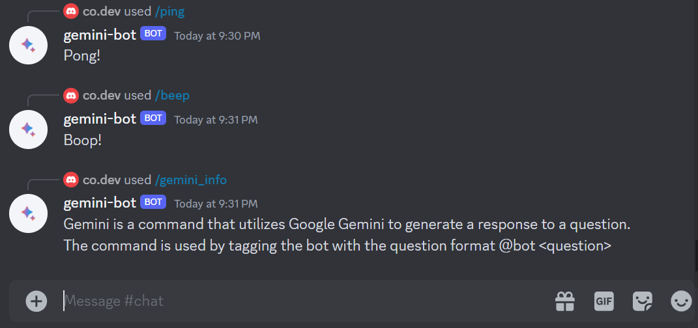
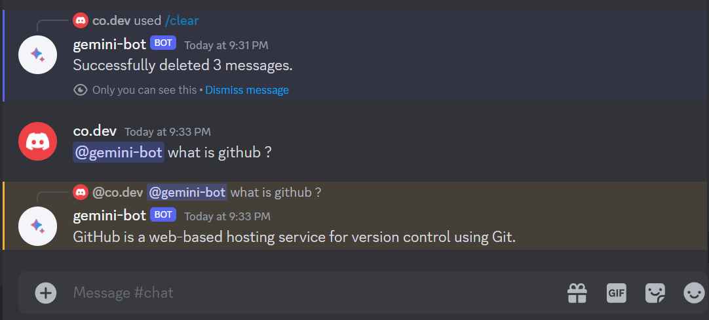
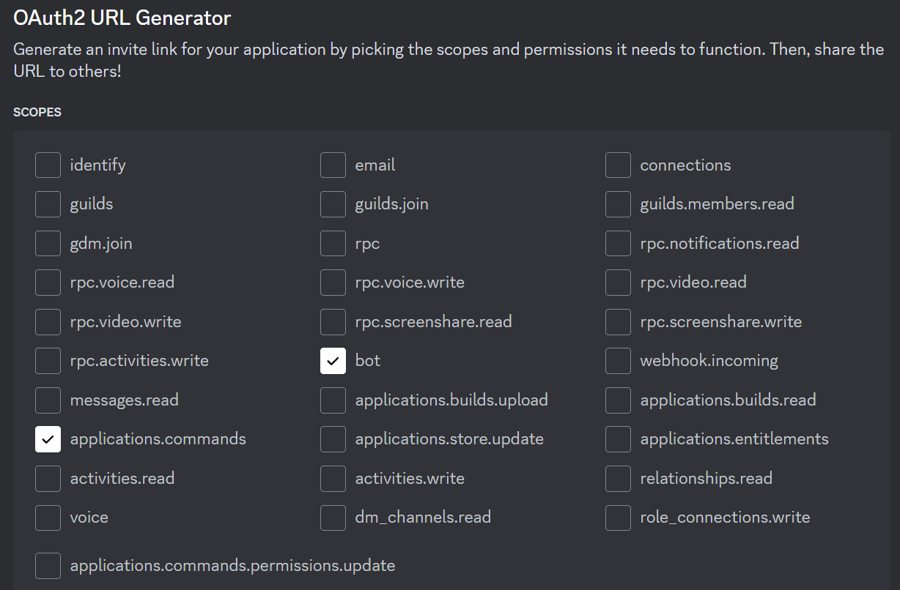
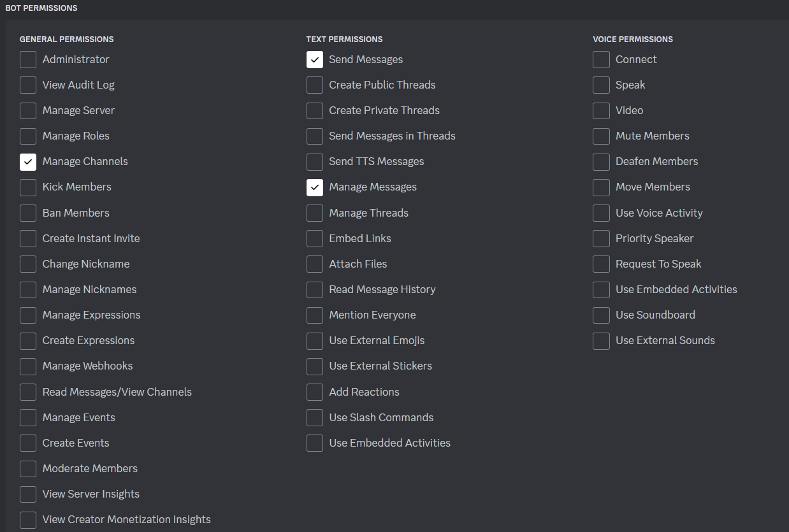

# Discord Gemini Bot

Simple Discord bot used to send requests to Google Gemini. Before running this bot, update the `.env` file with your Discord token and Google Gemini API token. Then, run the bot using `node ./src/main.mjs`.

## Docker
To run this bot with Docker:
- Fill the `.env` file and execute `docker build -t discord-gemini-bot .`
- Run the Docker image using `docker run discord-gemini-bot`, or run it in the background using `docker run --detach discord-gemini-bot`
- Use `docker ps` to view the running container and stop discord-gemini-bot using `docker stop <container_id>`

## Usage
To use the bot, simply tag your bot and ask a question. Each prompt will be answered in one sentence.

## Discord Permission
To use this bot, modify the Discord bot with the following permissions.

