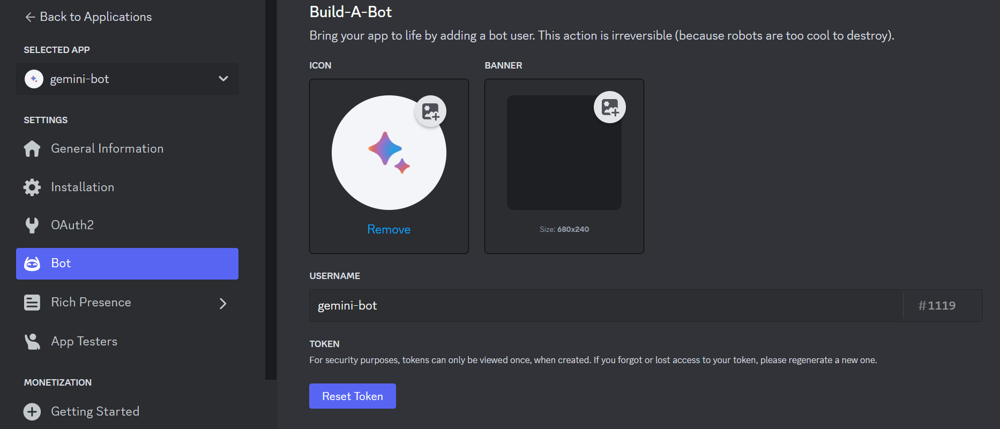
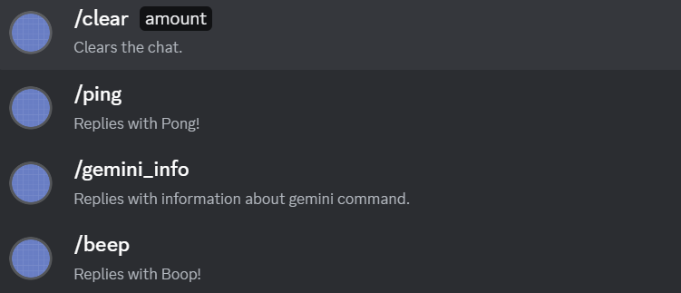

# Discord Bot with Gemini API

Simple Discord bot used to send requests to Google Gemini. Before running this bot, update the `.env` file with your Discord token and Google Gemini API token. Then, run the bot using `node ./src/main.mjs`.

## Docker
To run this bot with Docker:
- Fill the `.env` file and execute `docker build -t discord-gemini-bot .`
- Run the Docker image using `docker run discord-gemini-bot`, or run it in the background using `docker run --detach discord-gemini-bot`
- Use `docker ps` to view the running container and stop discord-gemini-bot using `docker stop <container_id>`

## Environment
Before running this bot, update `.env` using this template:
```env
// Discord token
DISCORD_TOKEN=
DISCORD_CHANNEL_ID=
DISCORD_CLIENT_ID=
DISCORD_GUILD_ID=

// Gemini API key
GEMINI_API_KEY=
```

### Discord Token (Bot Setup)
- Start by creating an app at `https://discord.com/developers/docs/intro`
- Obtain the token from the Bot section 

  <br/>


- Obtain the Client ID and [OAuth2 URL](#discord-permissions-oauth2-url-generator) from the OAuth section
- Invite the bot to your server using the OAuth2 URL
- Set CHANNEL_ID with your Discord Channel ID and GUILD_ID with your Discord Server ID

### Discord Permissions (OAuth2 URL Generator) 
To use this bot, modify the Discord bot with the following permissions.


### Gemini
Get your Gemini API key from `https://ai.google.dev/`

## Usage
To use the bot, simply tag your bot and ask a question. Each prompt will be answered in one sentence.




