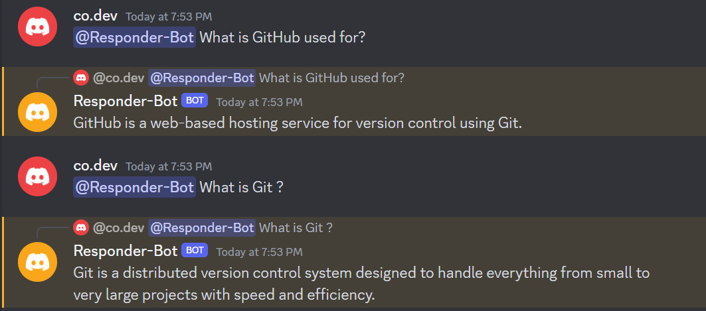

# Discord Gemini Bot

Simple Discord bot used to send requests to Google Gemini. Before running this bot, update the `.env` file with your Discord token and Google Gemini API token. Then, run the bot using `node ./src/main.mjs`.

## Usage
To use the bot, simply tag your bot and ask a question. Each prompt will be answered in one sentence.

